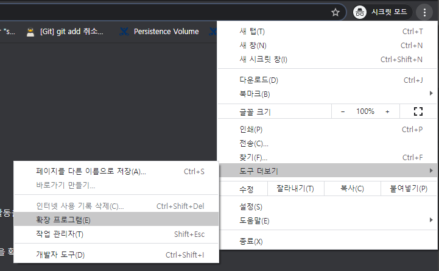
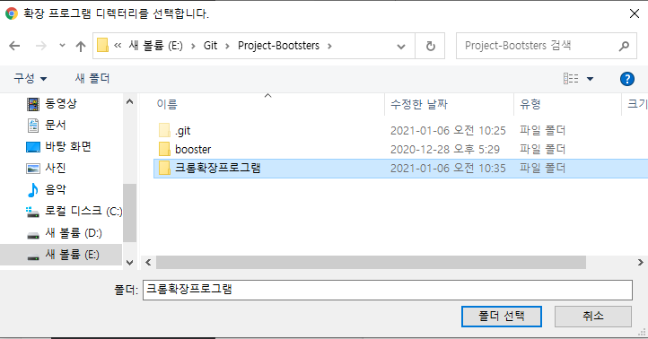
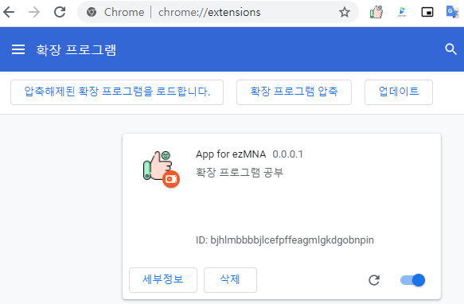
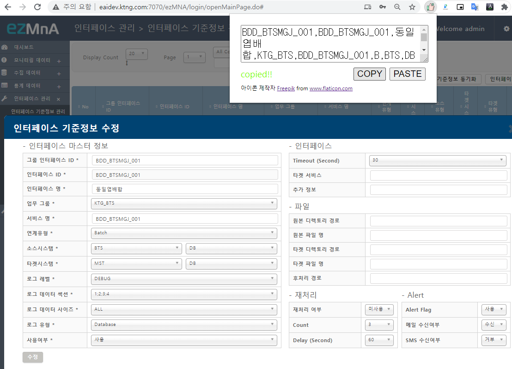
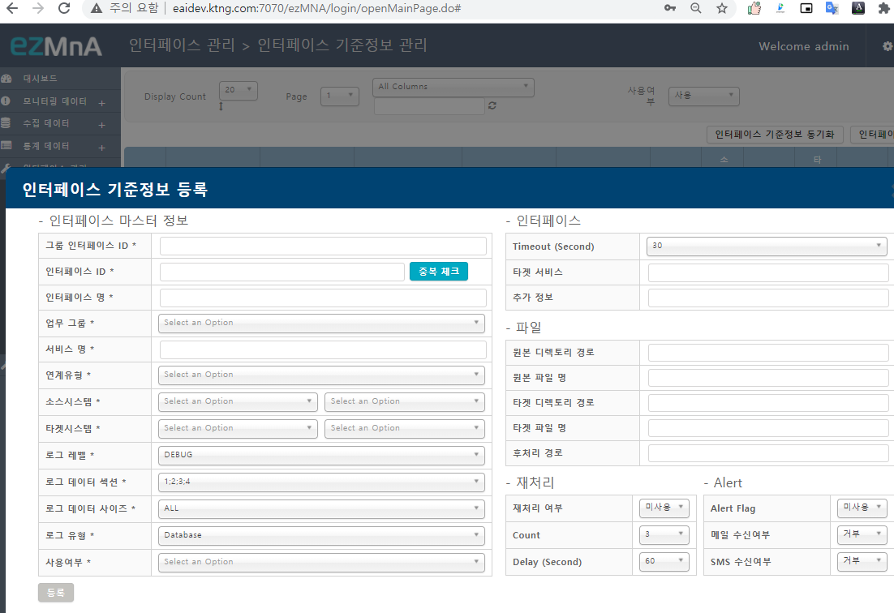
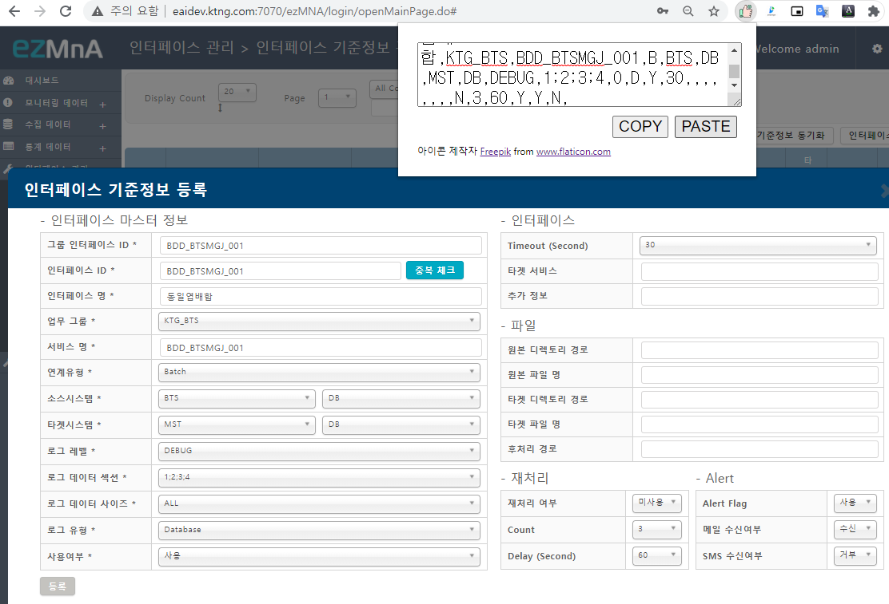

## 확장 프로그램 업로드

1. 확장 프로그매 페이지 접속 ([chrome://extensions/](chrome://extensions/))

   

2. **개발자 모드**를 활성화 해주면 확장 프로그램을 업로드 할수 있는 버튼이 나옵니다. 

   

3. **입축해제된 확장 프로그램을 로드합니다.**를 선택한후 로컬의 확장 프로그램이 있는 폴더를 선택합니다. 

   

4. 다음과 같이 확장 프로그램이 업로드 된 것을 확인할 수 있습니다. 

## 확장 프로그램 사용하기

이 확장 프로그램은 **ezMNA**에서 인터페이스 기준 정보와 같은 정보를 개발에서 스테이징 또는 운영으로 쉽게 옯기기 위한 프로그램입니다. popup으로 뜨는 모든 페이지에서 동작하지만 특정 값은 복사가 안될 수 있습니다. (^_^)

1. **인터페이스 기준정보**와 같은 **popup 페이지**를 연 다음 확장프로그램을 실행합니다. `COPY` 버튼을 클릭하면 현재 페이지의 데이터를 클립보드에 복사 됩니다. 

   

2. **인터페이스 기준 정보 등록** popup을 열어서 `COPY`한 데이터를 `PASTE`합니다. 

   

   